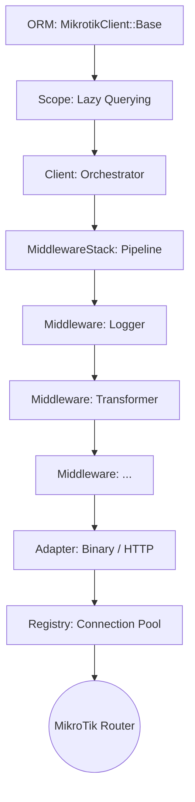

# Arquitectura de MikrotikClient

Este documento detalla las decisiones de diseño, los patrones utilizados y el flujo de datos dentro de la gema `MikrotikClient`. La arquitectura ha sido diseñada para ser modular, eficiente y fácil de extender.

## Visión General

`MikrotikClient` utiliza una arquitectura en capas inspirada en Faraday para la comunicación y en ActiveRecord/ActiveResource para el ORM.

## Patrones de Diseño Clave

### 1. Middleware Pipeline (Chain of Responsibility)
El núcleo de cada petición es una tubería de middlewares. Cada middleware tiene una responsabilidad única (loguear, transformar datos, manejar errores).
- **Por qué**: Permite añadir o quitar funcionalidades sin tocar el núcleo del cliente.
- **Cómo**: Implementado en `MikrotikClient::MiddlewareStack`, que construye una cadena de objetos donde cada uno llama al siguiente (`@app.call(env)`).

### 2. Adapter Pattern
Abstraemos la comunicación física con el router.
- **Por qué**: MikroTik soporta protocolos muy diferentes (API Binaria en v6/v7 y REST en v7.1+). El cliente no debe saber con quién habla.
- **Cómo**: Los adaptadores (`Binary`, `Http`) heredan de `Adapter::Base` y exponen una interfaz común.

### 3. Adapter Registry (Desacoplamiento)
Los adaptadores se registran a sí mismos en el `AdapterRegistry`.
- **Por qué**: Evita dependencias circulares entre el `Client` y la `Registry`. Permite añadir nuevos protocolos simplemente creando una nueva clase de adaptador.
- **Cómo**: Usamos el patrón Registry con soporte para `autoloading` vía Zeitwerk.

### 4. Connection Pooling & Registry
Manejamos un pool de conexiones persistentes (TCP sockets o HTTP) por cada router.
- **Por qué**: Abrir una conexión TCP y autenticarse es costoso. Reutilizar conexiones mejora drásticamente el rendimiento.
- **Cómo**: `MikrotikClient::Registry` actúa como un Singleton que gestiona instancias de `connection_pool` identificadas por una clave única (`user@host:port`).

### 5. Reaper (Background Worker)
Un hilo independiente que limpia conexiones inactivas.
- **Por qué**: Previene fugas de memoria y sockets abiertos innecesariamente.
- **Cómo**: `Registry::Reaper` corre en segundo plano y cierra pools que no han sido usados dentro del `idle_timeout`.

### 6. Scope & Lazy Loading (ORM)
El ORM no ejecuta peticiones inmediatamente.
- **Por qué**: Permite encadenar filtros (`.where(...).where(...)`) y permite inyectar clientes específicos antes de la ejecución.
- **Cómo**: `MikrotikClient::Scope` acumula el estado de la consulta y solo llama al cliente cuando se itera sobre los resultados (`.to_a`, `.each`).

## Flujo de una Petición

1.  **Entrada**: El usuario llama a `IpAddress.where(interface: 'ether1').all`.
2.  **Scope**: Se crea un objeto `Scope` con la cláusula de filtrado.
3.  **Ejecución**: Al acceder a los datos, el `Scope` solicita una conexión.
4.  **Registry**: La `Registry` busca un pool para ese router. Si no existe, crea uno, instancia el adaptador y lo conecta.
5.  **Pipeline**: El `Client` pasa el `env` (path, params, settings) a través del `MiddlewareStack`.
6.  **Transformación**: El `RequestTransformer` convierte los símbolos de Ruby a kebab-case para MikroTik.
7.  **Salida**: El `Adapter` envía los datos al router y recibe la respuesta.
8.  **Retorno**: El `Transformer` convierte la respuesta a tipos de Ruby y el `Scope` instancia los modelos.

## Consideraciones de Multi-tenancy

La gema utiliza `ActiveSupport::CurrentAttributes` (vía `MikrotikClient::Current`) para mantener el contexto de conexión por hilo. Esto permite que en aplicaciones Rails o Jobs de Sidekiq, cada hilo trabaje con un router diferente sin riesgo de colisión, manteniendo la simplicidad del ORM.
